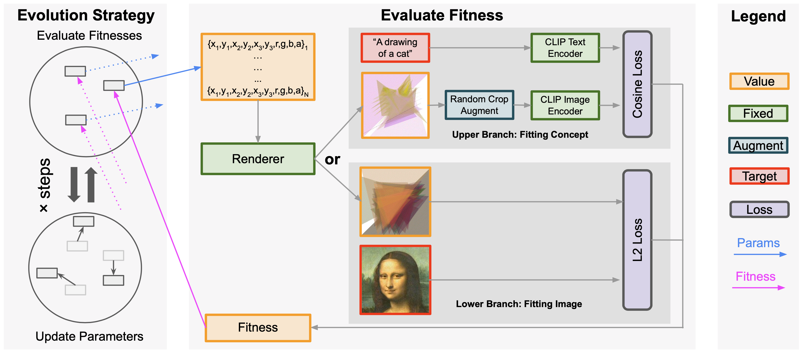

## Abstract 

Evolutionary algorithms have been used in the digital art scene since the 1970s. A popular application of genetic algorithms is to optimize the procedural placement of vector graphic primitives to resemble a given painting. In recent years, deep learning-based approaches have also been proposed to generate procedural drawings, which can be optimized using gradient descent. 

In this work, we revisit the use of evolutionary algorithms for computational creativity. We find that modern evolution strategies (ES) algorithms,  when tasked with the placement of shapes, offer large improvements in both quality and efficiency compared to traditional genetic algorithms, and even comparable to gradient-based methods. We demonstrate that ES is also well suited at optimizing the placement of shapes to fit the CLIP model, and can produce diverse, distinct geometric abstractions that are aligned with human interpretation of language. 
______

## Introduction

The Cubism art movement <dt-cite key="rewald2014heilbrunn"></dt-cite>, popularized by Pablo Picasso and other influential artists in the early 20th-century, abandoned the depiction of objects from tradition rules of perspective. Instead, objects are analyzed by the artist, broken up, and reassembled in an abstract form consisting of geometric representations. The use of simple geometry helped shaped the minimalist art <dt-cite key="tate_minimalism,rose1965abc"></dt-cite> and minimalist architecture movements, in which everything is stripped down to its essential quality to achieve simplicity <dt-cite key="bertoni2002minimalist"></dt-cite>. This minimalist approach is also evident later in Picasso's line drawings <dt-cite key="stein1984picasso,picasso_fearless"></dt-cite>.

Minimalist art has also been explored in computer generated art. Schmidhuber <dt-cite key="schmidhuber1997low"></dt-cite> proposed an art form in the 1990s, called <em>low-complexity art</em>, that attempts to depict the <em>essence</em> of an object by making use of ideas from algorithmic complexity <dt-cite key="kolmogorov1965three"></dt-cite>.
Similarly, genetic algorithms are a popular method applied to approximate images using simple shapes.
As one example, a basic genetic algorithm using evolution has been proposed <dt-cite key="johansson2008genetic,alteredqualia2008evolutiongenetic"></dt-cite> to represent a target image using semi-transparent, overlapping triangles (See "Basic" in Figure: Compare choices of evolution algorithm for an example). This approach has gained popularity over the years with the creative coding community, resulting in a number of sophisticated extensions <dt-cite key="fogleman2016,cason2016,shahrabi2020"></dt-cite>.

   <table style="width: 100%;" cellspacing="0" cellpadding="0">
      <tr>
         <td style="width: 50%;border: 1px solid transparent;"> 
            
         </td>
         <td style="width: 50%;border: 1px solid transparent;"> 
            <video class="b-lazy" data-src="assets/produced/es-bitmap-fit-monalisa-50-run-1.video.mp4" type="video/mp4" autoplay muted playsinline loop style="width: 95%;" />
         </td>
      </tr>
   </table>
   
   <figcaption style="text-align: left; color:#FF6C00; padding-top: 0;">Figure: Our method fitting painting "Mona Lisa"</figcaption>
   <figcaption style="text-align: left; padding-top: 0;">
      Our Method leverages modern ES (PGPE with ClipUp), which 50 triangles and runs for 10,000 steps to fit the target image "Mona Lisa"' here. 
      The target image is followed by the finally evolved results and the evolution process follows the target image.
   </figcaption>
   <!-- \label{fig:es-ours-mona-lisa} -->

With the recent resurgence of interest in evolution strategies (ES) in the machine learning community <dt-cite key="salimans2017evolution,ha2017evolving"></dt-cite>, in this work, we revisit the use of ES for creativity applications as an alternative to gradient-based methods. 
For the image-approximation with shapes task, we find that modern ES algorithms offer large improvements in both quality and efficiency when compared to traditional genetic algorithms, and as we will also demonstrate, even comparable to state-of-the-art differentiable rendering methods <dt-cite key="laine2020modular"></dt-cite>.

   <table style="width: 100%;" cellspacing="0" cellpadding="0">
      <tr style="border-top: 2px solid black; border-bottom: 2px solid gray;">
         <td> <b> Prompt </b> </td>
         <td> <b> Evolved Results </b> </td>
      </tr>
      <tr style="border-bottom: 2px solid gray;">
         <td style="width: 60%;border: 1px solid transparent;"> 
            "Self"
         </td>
         <td style="width: 40%;border: 1px solid transparent;"> 
            <video class="b-lazy" data-src="assets/produced/es-clip-[Self...]-50-run-1.video.mp4" type="video/mp4" autoplay muted playsinline loop style="width: 95%;" />
         </td>
      </tr>
      <tr style="border-bottom: 2px solid gray;">
         <td style="width: 60%;border: 1px solid transparent;"> 
            "Walt Disney World"
         </td>
         <td style="width: 40%;border: 1px solid transparent;"> 
            <video class="b-lazy" data-src="assets/produced/es-clip-[Walt Disney World...]-50-run-1.video.mp4" type="video/mp4" autoplay muted playsinline loop style="width: 95%;" />
         </td>
      </tr>
      <tr style="border-bottom: 2px solid black;">
         <td style="width: 60%;border: 1px solid transparent;"> 
            "The corporate headquarters complex of Google located at 1600 Amphitheatre Parkway in Mountain View, California."
         </td>
         <td style="width: 40%;border: 1px solid transparent;"> 
            <video class="b-lazy" data-src="assets/produced/es-clip-[The corporate headquarters complex of Go...]-50-run-1.video.mp4" type="video/mp4" autoplay muted playsinline loop style="width: 95%;" />
         </td>
      </tr>
   </table>
   
   <figcaption style="text-align: left; color:#FF6C00; padding-top: 0;">Figure: ES and CLIP fit the concept represented in text prompt</figcaption>
   <figcaption style="text-align: left; padding-top: 0;">
      ES and CLIP fit the concept represented in text prompt, using 50 triangles and running evolution for 2,000 steps. 
      Each row shows the text prompt followed by the finally evolved results and the evolution process. 
      We show exemplary prompts for 3 kinds of text, ranging from a single word ("Self"), a phrase ("Walt Disney Land"), and a long sentence (the last example).
   </figcaption>
   <!-- \label{fig:es-clip-examples} -->

We show that ES is also well suited at optimizing the placement of shapes to fit the CLIP <dt-cite key="radford2021learning"></dt-cite> model, and can produce diverse, distinct geometric abstractions that are aligned with human interpretation of language.
We provide a reference implementation and interactive notebook demos of our approach so that it can be a useful tool in the computational artist's toolbox.

## Modern Evolution Strategies based Creativity

   
   <figcaption style="text-align: left; color:#FF6C00; padding-top: 0;">Figure: The architecture of our method</figcaption>
   <figcaption style="text-align: left; padding-top: 0;">
      Our proposed method synthesizes painting by placing transparent triangles using Evolution Strategy (ES). 
      The ES algorithm calculates the fitness by first rendering the parameters on a canvas, and then using as the fitness the loss measuring how well the canvas fits a target image or an concept in the form of a text prompt.
      The fitness, in turn, guides the evolution process to find better parameters.
   </figcaption>
   <!-- \label{fig:architecture} -->

The architecture of our proposed is shown in Figure: The architecture of our method above.
Our proposed method synthesizes painting by placing transparent triangles using evolution strategy (ES).
Overall, we can represent a configuration of triangles in a parameter space which composes of positions and colors of triangles,
render such configuration onto a canvas,
and calculate its fitness based on how well the rendered canvas fits a target image or an concept in the form of a text prompt.
The ES algorithm keeps a pool of candidate configurations and uses mutations to evolves better ones measured by the said fitness.
To have better creative results, we use a modern ES algorithm, PGPE <dt-cite key="sehnke2010parameter"></dt-cite> optimized by ClipUp <dt-cite key="toklu2020clipup"></dt-cite> optimizer. 
Engineering-wise we use the pgpelib <dt-cite key="toklu2008pgpelib"></dt-cite> Python implementation of PGPE and ClipUp.

As we choose to follow the spirit of minimalist art, we use transparent triangles as the parameter space.
Concretely, a configuration of $N$ triangles is parameterized by a collection of $(x_1, y_1, x_2, y_2, x_3, y_3, r,g,b,a)$ for each of the triangles,
which are vertex coordinates and the RGBA (Red, Green, Blue, and Alpha a.k.a. transparency channel) color, totally making $10N$ parameters.
In the ES, we update all parameters and use a fixed hyper-parameter, the number of triangles $N$.
Note that $N$ is better understood as the upper bound of number of triangles to use: although $N$ is fixed, the algorithm is still capable of effectively using "fewer" triangles by making unwanted ones transparent.

As the ES is orthogonal to the concrete fitness evaluation, we are left with many free choices regarding what counts as fitting.
Particularly, we consider two kinds of fitness, namely, fitting a concrete image and fitting a concept (the lower branch and the upper branch in Figure: The architecture of our method above respectively).
Fitting a concrete image is straightforward, where we can simply use the pixel-wise L2 loss between the rendered canvas and the target image as the fitness.
Fitting a concept requires more elaboration. We represent the concept as a text prompt and embed the text prompt using the text encoder in CLIP <dt-cite key="radford2021learning"></dt-cite>. 
Then we embed the rendered canvas using the image encoder also available in CLIP. Since the CLIP models are trained so that both embedded images and texts are comparable under Cosine distance for similarity, we use such distance as the fitness.
We note that since the ES algorithm provides black-box optimization, the renderer, like fitness computation, does not necessarily need to be differentiable.

We find in practice a few decisions should be made so the whole pipeline can work reasonably well. 
First, we augment the rendered canvas by random cropping in calculating the fitness and average the fitness on each of the augmented canvas, following the practice of  <dt-cite key="samburtonking2021introduction,frans2021clipdraw"></dt-cite>. 
This would prevent the rendered canvas from overfitting and increase the stability in the optimization.
Second, we render the triangles on top of a background with a uniform distribution noise. Mathematically, this equals to modeling the uncertainty of parts in the canvas not covered by triangles with a max-entropy assumption, and using Monte Carlo method for approximation.
Finally, we limit the maximal alpha value for each triangle to $0.1$, which prevents front triangles from (overly) shadowing the back ones.

## Fitting Concrete Target Image

In this section, we show the performance of our proposed work on fitting a concrete target image.
In doing so, the model takes the lower branch in the architecture of our method
we show the result fitting the famous painting "Mona Lisa" with $50$ triangles and running evolution for $10,000$ steps in Figure: Our method fitting painting "Mona Lisa"  earlier in the text. 
The results show a distinctive art style represented by well-placed triangles that care both fine-grained textures and large backgrounds. 
The evolution process also demonstrates the coarse-to-fine adjustment of triangles' positions and colors.

   <table style="width: 100%; border-collapse: collapse;" cellspacing="0" cellpadding="0">
      <tr style="border-top: 2px solid black; border-bottom: 2px solid gray;">
         <td> <b> Target Image </b> </td>
         <td> <b> 10 Triangles </b> </td>
         <td> <b> 25 Triangles </b> </td>
         <td> <b> 50 Triangles </b> </td>
         <td> <b> 200 Triangles </b> </td>
      </tr>
      <tr>
         <td style="width: 20%;border: 1px solid transparent;"> 
            
         </td>
         <td style="width: 20%;border: 1px solid transparent;"> 
            <video class="b-lazy" data-src="assets/produced/es-bitmap-fit-darwin-10-run-1.video.mp4" type="video/mp4" autoplay muted playsinline loop style="width: 95%;" />
         </td>
         <td style="width: 20%;border: 1px solid transparent;"> 
            <video class="b-lazy" data-src="assets/produced/es-bitmap-fit-darwin-25-run-1.video.mp4" type="video/mp4" autoplay muted playsinline loop style="width: 95%;" />
         </td>
         <td style="width: 20%;border: 1px solid transparent;"> 
            <video class="b-lazy" data-src="assets/produced/es-bitmap-fit-darwin-50-run-1.video.mp4" type="video/mp4" autoplay muted playsinline loop style="width: 95%;" />
         </td>
         <td style="width: 20%;border: 1px solid transparent;"> 
            <video class="b-lazy" data-src="assets/produced/es-bitmap-fit-darwin-200-run-1.video.mp4" type="video/mp4" autoplay muted playsinline loop style="width: 95%;" />
         </td>
      </tr>
      <tr style="border-bottom: 2px solid gray;">
         <td> "Darwin"          </td>
         <td> Fitness = 96.82%  </td>
         <td> Fitness = 99.25%  </td>
         <td> Fitness = 99.08%  </td>
         <td> Fitness = 99.25%  </td>
      </tr>
      <tr>
         <td style="width: 20%;border: 1px solid transparent;"> 
            
         </td>
         <td style="width: 20%;border: 1px solid transparent;"> 
            <video class="b-lazy" data-src="assets/produced/es-bitmap-fit-monalisa-10-run-1.video.mp4" type="video/mp4" autoplay muted playsinline loop style="width: 95%;" />
         </td>
         <td style="width: 20%;border: 1px solid transparent;"> 
            <video class="b-lazy" data-src="assets/produced/es-bitmap-fit-monalisa-25-run-1.video.mp4" type="video/mp4" autoplay muted playsinline loop style="width: 95%;" />
         </td>
         <td style="width: 20%;border: 1px solid transparent;"> 
            <video class="b-lazy" data-src="assets/produced/es-bitmap-fit-monalisa-50-run-1.video.mp4" type="video/mp4" autoplay muted playsinline loop style="width: 95%;" />
         </td>
         <td style="width: 20%;border: 1px solid transparent;"> 
            <video class="b-lazy" data-src="assets/produced/es-bitmap-fit-monalisa-200-run-1.video.mp4" type="video/mp4" autoplay muted playsinline loop style="width: 95%;" />
         </td>
      </tr>
      <tr style="border-bottom: 2px solid gray;">
         <td> "Mona Lisa"       </td>
         <td> Fitness = 98.02%  </td>
         <td> Fitness = 99.30%  </td>
         <td> Fitness = 99.62%  </td>
         <td> Fitness = 99.80%  </td>
      </tr>
      <tr>
         <td style="width: 20%;border: 1px solid transparent;"> 
            
         </td>
         <td style="width: 20%;border: 1px solid transparent;"> 
            <video class="b-lazy" data-src="assets/produced/es-bitmap-fit-waifu-10-run-1.video.mp4" type="video/mp4" autoplay muted playsinline loop style="width: 95%;" />
         </td>
         <td style="width: 20%;border: 1px solid transparent;"> 
            <video class="b-lazy" data-src="assets/produced/es-bitmap-fit-waifu-25-run-1.video.mp4" type="video/mp4" autoplay muted playsinline loop style="width: 95%;" />
         </td>
         <td style="width: 20%;border: 1px solid transparent;"> 
            <video class="b-lazy" data-src="assets/produced/es-bitmap-fit-waifu-50-run-1.video.mp4" type="video/mp4" autoplay muted playsinline loop style="width: 95%;" />
         </td>
         <td style="width: 20%;border: 1px solid transparent;"> 
            <video class="b-lazy" data-src="assets/produced/es-bitmap-fit-waifu-200-run-1.video.mp4" type="video/mp4" autoplay muted playsinline loop style="width: 95%;" />
         </td>
      </tr>
      <tr style="border-bottom: 2px solid gray;">
         <td> "Anime Face"      </td>
         <td> Fitness = 94.97%  </td>
         <td> Fitness = 98.17%  </td>
         <td> Fitness = 98.80%  </td>
         <td> Fitness = 99.07%  </td>
      </tr>
      <tr>
         <td style="width: 20%;border: 1px solid transparent;"> 
            
         </td>
         <td style="width: 20%;border: 1px solid transparent;"> 
            <video class="b-lazy" data-src="assets/produced/es-bitmap-fit-landscape-10-run-1.video.mp4" type="video/mp4" autoplay muted playsinline loop style="width: 95%;" />
         </td>
         <td style="width: 20%;border: 1px solid transparent;"> 
            <video class="b-lazy" data-src="assets/produced/es-bitmap-fit-landscape-25-run-1.video.mp4" type="video/mp4" autoplay muted playsinline loop style="width: 95%;" />
         </td>
         <td style="width: 20%;border: 1px solid transparent;"> 
            <video class="b-lazy" data-src="assets/produced/es-bitmap-fit-landscape-50-run-1.video.mp4" type="video/mp4" autoplay muted playsinline loop style="width: 95%;" />
         </td>
         <td style="width: 20%;border: 1px solid transparent;"> 
            <video class="b-lazy" data-src="assets/produced/es-bitmap-fit-landscape-200-run-1.video.mp4" type="video/mp4" autoplay muted playsinline loop style="width: 95%;" />
         </td>
      </tr>
      <tr style="border-bottom: 2px solid gray;">
         <td> "Landscape"       </td>
         <td> Fitness = 97.07%  </td>
         <td> Fitness = 98.83%  </td>
         <td> Fitness = 99.08%  </td>
         <td> Fitness = 99.25%  </td>
      </tr>
         <tr>
         <td style="width: 20%;border: 1px solid transparent;"> 
            
         </td>
         <td style="width: 20%;border: 1px solid transparent;"> 
            <video class="b-lazy" data-src="assets/produced/es-bitmap-fit-impressionism-10-run-1.video.mp4" type="video/mp4" autoplay muted playsinline loop style="width: 95%;" />
         </td>
         <td style="width: 20%;border: 1px solid transparent;"> 
            <video class="b-lazy" data-src="assets/produced/es-bitmap-fit-impressionism-25-run-1.video.mp4" type="video/mp4" autoplay muted playsinline loop style="width: 95%;" />
         </td>
         <td style="width: 20%;border: 1px solid transparent;"> 
            <video class="b-lazy" data-src="assets/produced/es-bitmap-fit-impressionism-50-run-1.video.mp4" type="video/mp4" autoplay muted playsinline loop style="width: 95%;" />
         </td>
         <td style="width: 20%;border: 1px solid transparent;"> 
            <video class="b-lazy" data-src="assets/produced/es-bitmap-fit-impressionism-200-run-1.video.mp4" type="video/mp4" autoplay muted playsinline loop style="width: 95%;" />
         </td>
      </tr>
      <tr style="border-bottom: 2px solid gray;">
         <td> "Impressionism"   </td>
         <td> Fitness = 98.82%  </td>
         <td> Fitness = 99.23%  </td>
         <td> Fitness = 99.34%  </td>
         <td> Fitness = 99.48%  </td>
      </tr>
   </table>

   <figcaption style="text-align: left; color:#FF6C00; padding-top: 0;">Figure: Qualitative and quantitative results from fitting target images with different number of triangles</figcaption>
   <figcaption style="text-align: left; padding-top: 0;">
      Qualitative and quantitative results from fitting several targets with 10, 25, 50, and 200 triangles, each running for 10,000 steps.
      Images credits: Darwin, Mona Lisa, Velociraptor are from <dt-cite key="alteredqualia2008evolutiongenetic"></dt-cite>. Anime Face is generated by Waifu Labs <dt-cite key="sizigi2019waifu"></dt-cite>. 
      Landscape is from Wikipedia<dt-cite key="wiki:landscape"></dt-cite>. Impressionism is <em>A May Morning in Moret</em> by Alfred Sisley, collected by <dt-cite key="gonsalves2021impressionist"></dt-cite>
   </figcaption>
   <!-- \label{fig:es-ours-different-n-triangles} -->

<b>Number of triangles and parameters</b>.
Our proposed pipeline is able to fit any target images and could handle a wide range of number of parameters, since PGPE runs efficiently, i.e., linear to the number of parameters. 
This is demonstrated by applying our method to fit several target images with $10$, $25$, $50$, $200$ triangles, which corresponds to $100$, $250$, $500$ and $2000$ parameters respectively.
As shown in  Figure: Qualitative and quantitative results from fitting target images with different number of triangles above,
our proposed pipeline works well for a wide range of target images, and the ES algorithm is capable of using the number of triangles as a "computational budget" where extra triangles could always be utilized for gaining in fitness. 
This allows a human artist to use the number of triangles in order to find the right balance between abstractness and details in the produced art.

   <table style="width: 100%;" cellspacing="0" cellpadding="0">
      <tr style="border-top: 2px solid black; border-bottom: 2px solid gray;">
         <td> <b> Target Image </b> </td>
         <td> <b> Ours (10k iters) </b> </td>
         <td> <b> Basic (10k iters) </b> </td>
         <td> <b> Basic (560k iters) </b> </td>
      </tr>
      <tr style="border-bottom: 2px solid gray;">
         <td style="width: 25%;border: 1px solid transparent;"> 
            
         </td>
         <td style="width: 25%;border: 1px solid transparent;"> 
            <video class="b-lazy" data-src="assets/produced/es-bitmap-fit-monalisa-50-run-1.video.mp4" type="video/mp4" autoplay muted playsinline loop style="width: 95%;" />
         </td>
         <td style="width: 25%;border: 1px solid transparent;"> 
            <video class="b-lazy" data-src="assets/produced/es-bitmap-basicfit-monalisa-50-run-1.video.mp4" type="video/mp4" autoplay muted playsinline loop style="width: 95%;" />
         </td>
         <td style="width: 25%;border: 1px solid transparent;"> 
            
         </td>
      </tr>
   </table>
   
   <figcaption style="text-align: left; color:#FF6C00; padding-top: 0;">Figure: Compare choices of evolution algorithm</figcaption>
   <figcaption style="text-align: left; padding-top: 0;">
      Compare choices of evolution algorithm: Ours (PGPE with ClipUp) vs. a basic evolution algorithm (mutation with simulated Annealing) <dt-cite key="alteredqualia2008evolutiongenetic"></dt-cite>. Both setting fits 50 triangles and all choices except for the evolution algorithm are the same. 
      We show the evolved result and evolution process of ours and the basic algorithm at the end of 10,000 iterations, and the result of the basic algorithm after running <em>56</em> times more iterations.
   </figcaption>
   <!-- \label{fig:es-ours-vs-basic} -->

<b>Choice of ES Algorithm</b>.
We compare two choices of evolution algorithm: ours, which uses the recent PGPE with ClipUp, and a basic, traditional one, which consists of mutation and simulated annealing adopted earlier <dt-cite key="johansson2008genetic,alteredqualia2008evolutiongenetic"></dt-cite>. 
As shown in Figure: Compare choices of evolution algorithm above, our choice of more recent algorithms leads to better results than the basic one under the same parameter budget.
Subjectively, our final results are more visually closer to the target image with a smoother evolution process, and quantitatively, our method leads to much better fitness ($99.62\%$ vs. $97.23\%$). 
Furthermore, even allowing $56$ times more iterations for the basic algorithm does not lead to results better than ours.

   <table style="width: 100%;" cellspacing="0" cellpadding="0">
      <tr style="border-top: 2px solid black; border-bottom: 2px solid gray;">
         <td> <b> Target Image </b> </td>
         <td> <b> Evolution Strategy   (Non-gradient) </b> </td>
         <td> <b> Differentiable Renderer   (Gradient-based) </b> </td>
      </tr>
      <tr style="border-bottom: 2px solid gray;">
         <td style="width: 33%;border: 1px solid transparent;"> 
            
         </td>
         <td style="width: 33%;border: 1px solid transparent;"> 
            <video class="b-lazy" data-src="assets/produced/es-bitmap-fit-monalisa-200-run-1.video.mp4" type="video/mp4" autoplay muted playsinline loop style="width: 95%;" />
         </td>
         <td style="width: 33%;border: 1px solid transparent;"> 
            <video class="b-lazy" data-src="assets/produced/es-bitmap-diff-monalisa-run-1.video.mp4" type="video/mp4" autoplay muted playsinline loop style="width: 95%;" />
         </td>
      </tr>
   </table>
   
   <figcaption style="text-align: left; color:#FF6C00; padding-top: 0;">Figure: Evolution strategies vs. differentiable renderer</figcaption>
   <figcaption style="text-align: left; padding-top: 0;">
      Evolution Strategies (non-gradient method) vs Differentiable renderer (gradient based method) fitting text prompt through CLIP using 200 triangles. 
   </figcaption>
   <!-- \label{fig:es-vs-diff} -->

<b>Comparison with Gradient-based Optimization</b>.
While our proposed approach is ES-based, it is interesting to investigate how it compares to gradient-based optimization since the latter is commonly adopted recently .
Therefore we conduct a gradient-based setup by implementing rendering of composed triangles using nvdiffrast <dt-cite key="laine2020modular"></dt-cite>, a point-sampling-based differentiable renderer.
We use the same processing as does our ES approach.
As shown in Figure: Evolution strategies vs. differentiable renderer above, our proposed ES-based method can achieve similar yet slightly higher fitness than results compared with the gradient-optimized differentiable renderer.
Furthermore and perhaps more interestingly, two methods produce artworks with different styles: 
our proposed method can adaptive allocating large triangles for background and small ones for detailed textures, 
whereas the differentiable renderer tends to introduce textures unseen in the target image (especially in the background). 
We argue that due to the difference in the optimization mechanism, our method focuses more on the placement of triangles while the differentiable renderer pays attention to the compositing of transparent colors.

## Fitting Abstract Concept with CLIP

In this section, we show the performance of our method configured to fit an abstract concept represented by language. 
In doing so, the model takes the upper branch in Figure: The architecture of our method above.
Formally, the parameter space remains the same, but the fitness is calculated as the cosine distance between the text prompt and the rendered canvas, both encoded by CLIP. 
Since the model is given more freedom to decide what to paint, this problem is arguably a much harder yet more interesting problem than fitting concrete images in the previous section.

In Figure: ES and CLIP fit the concept represented in text prompt earlier in the text,  we show the evolution result and process of fitting abstract concept represented as text prompt, using 50 triangles and running evolution for $2,000$ steps. 
Our method could handle text prompts ranging from a single word to a phrase, and finally, to a long sentence, even though the task itself is arguably more challenging than the previous one.
The results show a creative art concept that is abstract, not resembling a particular image, yet correlated with humans' interpretation of the text.
The evolution process also demonstrates iterative adjustment, such as the human shape in the first two examples, the shape of castles in Disney World, as well as in the final example, the cooperate-themed headquarters.
Also, compared to fitting concrete images in the previous section, our method cares more about the placement of triangles.

   <table style="width: 100%; border-collapse: collapse;" cellspacing="0" cellpadding="0">
      <tr style="border-top: 2px solid black; border-bottom: 2px solid gray;">
         <td> <b> Prompt </b> </td>
         <td> <b> 10 Triangles </b> </td>
         <td> <b> 25 Triangles </b> </td>
         <td> <b> 50 Triangles </b> </td>
         <td> <b> 200 Triangles </b> </td>
      </tr>
      <tr style="border-bottom: 2px solid gray;">
         <td style="width: 20%;border: 1px solid transparent;"> 
            "Self"
         </td>
         <td style="width: 20%;border: 1px solid transparent;"> 
            <video class="b-lazy" data-src="assets/produced/es-clip-[Self...]-10-run-2-1.video.mp4" type="video/mp4" autoplay muted playsinline loop style="width: 95%;" />
         </td>
         <td style="width: 20%;border: 1px solid transparent;"> 
            <video class="b-lazy" data-src="assets/produced/es-clip-[Self...]-25-run-2-1.video.mp4" type="video/mp4" autoplay muted playsinline loop style="width: 95%;" />
         </td>
         <td style="width: 20%;border: 1px solid transparent;"> 
            <video class="b-lazy" data-src="assets/produced/es-clip-[Self...]-50-run-2-1.video.mp4" type="video/mp4" autoplay muted playsinline loop style="width: 95%;" />
         </td>
         <td style="width: 20%;border: 1px solid transparent;"> 
            <video class="b-lazy" data-src="assets/produced/es-clip-[Self...]-200-run-2-1.video.mp4" type="video/mp4" autoplay muted playsinline loop style="width: 95%;" />
         </td>
      </tr>
      <tr style="border-bottom: 2px solid gray;">
         <td style="width: 20%;border: 1px solid transparent;"> 
            "Human"
         </td>
         <td style="width: 20%;border: 1px solid transparent;"> 
            <video class="b-lazy" data-src="assets/produced/es-clip-[Human...]-10-run-2-1.video.mp4" type="video/mp4" autoplay muted playsinline loop style="width: 95%;" />
         </td>
         <td style="width: 20%;border: 1px solid transparent;"> 
            <video class="b-lazy" data-src="assets/produced/es-clip-[Human...]-25-run-2-1.video.mp4" type="video/mp4" autoplay muted playsinline loop style="width: 95%;" />
         </td>
         <td style="width: 20%;border: 1px solid transparent;"> 
            <video class="b-lazy" data-src="assets/produced/es-clip-[Human...]-50-run-2-1.video.mp4" type="video/mp4" autoplay muted playsinline loop style="width: 95%;" />
         </td>
         <td style="width: 20%;border: 1px solid transparent;"> 
            <video class="b-lazy" data-src="assets/produced/es-clip-[Human...]-200-run-2-1.video.mp4" type="video/mp4" autoplay muted playsinline loop style="width: 95%;" />
         </td>
      </tr>
      <tr style="border-bottom: 2px solid gray;">
         <td style="width: 20%;border: 1px solid transparent;"> 
            "Walt Disney World"
         </td>
         <td style="width: 20%;border: 1px solid transparent;"> 
            <video class="b-lazy" data-src="assets/produced/es-clip-[Walt Disney World...]-10-run-2-1.video.mp4" type="video/mp4" autoplay muted playsinline loop style="width: 95%;" />
         </td>
         <td style="width: 20%;border: 1px solid transparent;"> 
            <video class="b-lazy" data-src="assets/produced/es-clip-[Walt Disney World...]-25-run-2-1.video.mp4" type="video/mp4" autoplay muted playsinline loop style="width: 95%;" />
         </td>
         <td style="width: 20%;border: 1px solid transparent;"> 
            <video class="b-lazy" data-src="assets/produced/es-clip-[Walt Disney World...]-50-run-2-1.video.mp4" type="video/mp4" autoplay muted playsinline loop style="width: 95%;" />
         </td>
         <td style="width: 20%;border: 1px solid transparent;"> 
            <video class="b-lazy" data-src="assets/produced/es-clip-[Walt Disney World...]-200-run-2-1.video.mp4" type="video/mp4" autoplay muted playsinline loop style="width: 95%;" />
         </td>
      </tr>
      <tr style="border-bottom: 2px solid gray;">
         <td style="width: 20%;border: 1px solid transparent;"> 
            "A picture of Tokyo"
         </td>
         <td style="width: 20%;border: 1px solid transparent;"> 
            <video class="b-lazy" data-src="assets/produced/es-clip-[A picture of Tokyo...]-10-run-2-1.video.mp4" type="video/mp4" autoplay muted playsinline loop style="width: 95%;" />
         </td>
         <td style="width: 20%;border: 1px solid transparent;"> 
            <video class="b-lazy" data-src="assets/produced/es-clip-[A picture of Tokyo...]-25-run-2-1.video.mp4" type="video/mp4" autoplay muted playsinline loop style="width: 95%;" />
         </td>
         <td style="width: 20%;border: 1px solid transparent;"> 
            <video class="b-lazy" data-src="assets/produced/es-clip-[A picture of Tokyo...]-50-run-2-1.video.mp4" type="video/mp4" autoplay muted playsinline loop style="width: 95%;" />
         </td>
         <td style="width: 20%;border: 1px solid transparent;"> 
            <video class="b-lazy" data-src="assets/produced/es-clip-[A picture of Tokyo...]-200-run-2-1.video.mp4" type="video/mp4" autoplay muted playsinline loop style="width: 95%;" />
         </td>
      </tr>
      <tr style="border-bottom: 2px solid gray;">
         <td style="width: 20%;border: 1px solid transparent;"> 
            

               <small> "The corporate headquarters complex of Google located at 1600 Amphitheatre Parkway in Mountain View, California." </small>
            

         </td>
         <td style="width: 20%;border: 1px solid transparent;"> 
            <video class="b-lazy" data-src="assets/produced/es-clip-[The corporate headquarters complex of Go...]-10-run-2-1.video.mp4" type="video/mp4" autoplay muted playsinline loop style="width: 95%;" />
         </td>
         <td style="width: 20%;border: 1px solid transparent;"> 
            <video class="b-lazy" data-src="assets/produced/es-clip-[The corporate headquarters complex of Go...]-25-run-2-1.video.mp4" type="video/mp4" autoplay muted playsinline loop style="width: 95%;" />
         </td>
         <td style="width: 20%;border: 1px solid transparent;"> 
            <video class="b-lazy" data-src="assets/produced/es-clip-[The corporate headquarters complex of Go...]-50-run-2-1.video.mp4" type="video/mp4" autoplay muted playsinline loop style="width: 95%;" />
         </td>
         <td style="width: 20%;border: 1px solid transparent;"> 
            <video class="b-lazy" data-src="assets/produced/es-clip-[The corporate headquarters complex of Go...]-200-run-2-1.video.mp4" type="video/mp4" autoplay muted playsinline loop style="width: 95%;" />
         </td>
      </tr>
      <tr style="border-bottom: 2px solid black;">
         <td style="width: 20%;border: 1px solid transparent;"> 
            

               <small> "The United States of America commonly known as the United States or America is a country primarily located in North America." </small>
            

         </td>
         <td style="width: 20%;border: 1px solid transparent;"> 
            <video class="b-lazy" data-src="assets/produced/es-clip-[The United States of America commonly kn...]-10-run-2-1.video.mp4" type="video/mp4" autoplay muted playsinline loop style="width: 95%;" />
         </td>
         <td style="width: 20%;border: 1px solid transparent;"> 
            <video class="b-lazy" data-src="assets/produced/es-clip-[The United States of America commonly kn...]-25-run-2-1.video.mp4" type="video/mp4" autoplay muted playsinline loop style="width: 95%;" />
         </td>
         <td style="width: 20%;border: 1px solid transparent;"> 
            <video class="b-lazy" data-src="assets/produced/es-clip-[The United States of America commonly kn...]-50-run-2-1.video.mp4" type="video/mp4" autoplay muted playsinline loop style="width: 95%;" />
         </td>
         <td style="width: 20%;border: 1px solid transparent;"> 
            <video class="b-lazy" data-src="assets/produced/es-clip-[The United States of America commonly kn...]-200-run-2-1.video.mp4" type="video/mp4" autoplay muted playsinline loop style="width: 95%;" />
         </td>
      </tr>
   </table>

   <figcaption style="text-align: left; color:#FF6C00; padding-top: 0;">Figure: Qualitative results from ES and CLIP fitting several text prompt with different numbers of triangles</figcaption>
   <figcaption style="text-align: left; padding-top: 0;">
      Qualitative results from ES and CLIP fitting several text prompt with 10,25,50, and 200 triangles, each running for 2,000 steps. 
      We show exemplary prompts for three kinds of text, ranging from a single word ("Self" and "Human"), a phrase ("Walt Disney Land" and "A picture of Tokyo"), and a long sentence (last two examples). 
   </figcaption>
   <!-- \label{fig:es-clip-different-n-triangles} -->

<b>Number of triangles and parameters</b>.
Like fitting a concrete image, we can also fit an abstract concept with a wide range of number of parameters since the PGPE algorithm and the way we represent canvas remains the same.
In Figure: Qualitative results from ES and CLIP fitting several text prompt with different numbers of triangles above, we apply our method to fit several concept (text prompt) with $10$, $25$, $50$, $200$ triangles, which corresponds to $100$, $250$, $500$ and $2000$ parameters respectively.
It is shown that our proposed pipeline is capable of leveraging the number of triangles as a "budget for fitting" to balance between the details and the level of abstraction. 
Like in the previous task, this allows a human artist to balance the abstractness in the produced art.

We observe that while the model could comfortably handle at least up to $50$ triangles, more triangles ($200$) sometimes poses challenges: for example, with $200$ triangles, "corporate headquarters ..." gets a better result while "a picture of Tokyo" leads to a poor one. This may be due to the difficulties composing overly shadowed triangles, and we leave it for future study. 

   <table style="width: 100%; border-collapse: collapse;" cellspacing="0" cellpadding="0">
      <tr style="border-top: 2px solid black; border-bottom: 2px solid gray;">
         <td> <b> Prompt </b> </td>
         <td colspan="4"> <b> 4 Individual Runs </b> </td>      </tr>
      <tr style="border-bottom: 2px solid gray;">
         <td style="width: 20%;border: 1px solid transparent;"> 
            "Self"
         </td>
         <td style="width: 20%;border: 1px solid transparent;"> 
            <video class="b-lazy" data-src="assets/produced/es-clip-[Self...]-50-run-2-1.video.mp4" type="video/mp4" autoplay muted playsinline loop style="width: 95%;" />
         </td>
         <td style="width: 20%;border: 1px solid transparent;"> 
            <video class="b-lazy" data-src="assets/produced/es-clip-[Self...]-50-run-2-2.video.mp4" type="video/mp4" autoplay muted playsinline loop style="width: 95%;" />
         </td>
         <td style="width: 20%;border: 1px solid transparent;"> 
            <video class="b-lazy" data-src="assets/produced/es-clip-[Self...]-50-run-2-3.video.mp4" type="video/mp4" autoplay muted playsinline loop style="width: 95%;" />
         </td>
         <td style="width: 20%;border: 1px solid transparent;"> 
            <video class="b-lazy" data-src="assets/produced/es-clip-[Self...]-50-run-2-4.video.mp4" type="video/mp4" autoplay muted playsinline loop style="width: 95%;" />
         </td>
      </tr>
      <tr style="border-bottom: 2px solid gray;">
         <td style="width: 20%;border: 1px solid transparent;"> 
            "Human"
         </td>
         <td style="width: 20%;border: 1px solid transparent;"> 
            <video class="b-lazy" data-src="assets/produced/es-clip-[Human...]-50-run-2-1.video.mp4" type="video/mp4" autoplay muted playsinline loop style="width: 95%;" />
         </td>
         <td style="width: 20%;border: 1px solid transparent;"> 
            <video class="b-lazy" data-src="assets/produced/es-clip-[Human...]-50-run-2-2.video.mp4" type="video/mp4" autoplay muted playsinline loop style="width: 95%;" />
         </td>
         <td style="width: 20%;border: 1px solid transparent;"> 
            <video class="b-lazy" data-src="assets/produced/es-clip-[Human...]-50-run-2-3.video.mp4" type="video/mp4" autoplay muted playsinline loop style="width: 95%;" />
         </td>
         <td style="width: 20%;border: 1px solid transparent;"> 
            <video class="b-lazy" data-src="assets/produced/es-clip-[Human...]-50-run-2-4.video.mp4" type="video/mp4" autoplay muted playsinline loop style="width: 95%;" />
         </td>
      </tr>
      <tr style="border-bottom: 2px solid gray;">
         <td style="width: 20%;border: 1px solid transparent;"> 
            "Walt Disney World"
         </td>
         <td style="width: 20%;border: 1px solid transparent;"> 
            <video class="b-lazy" data-src="assets/produced/es-clip-[Walt Disney World...]-50-run-2-1.video.mp4" type="video/mp4" autoplay muted playsinline loop style="width: 95%;" />
         </td>
         <td style="width: 20%;border: 1px solid transparent;"> 
            <video class="b-lazy" data-src="assets/produced/es-clip-[Walt Disney World...]-50-run-2-2.video.mp4" type="video/mp4" autoplay muted playsinline loop style="width: 95%;" />
         </td>
         <td style="width: 20%;border: 1px solid transparent;"> 
            <video class="b-lazy" data-src="assets/produced/es-clip-[Walt Disney World...]-50-run-2-3.video.mp4" type="video/mp4" autoplay muted playsinline loop style="width: 95%;" />
         </td>
         <td style="width: 20%;border: 1px solid transparent;"> 
            <video class="b-lazy" data-src="assets/produced/es-clip-[Walt Disney World...]-50-run-2-4.video.mp4" type="video/mp4" autoplay muted playsinline loop style="width: 95%;" />
         </td>
      </tr>
      <tr style="border-bottom: 2px solid gray;">
         <td style="width: 20%;border: 1px solid transparent;"> 
            "A picture of Tokyo"
         </td>
         <td style="width: 20%;border: 1px solid transparent;"> 
            <video class="b-lazy" data-src="assets/produced/es-clip-[A picture of Tokyo...]-50-run-2-1.video.mp4" type="video/mp4" autoplay muted playsinline loop style="width: 95%;" />
         </td>
         <td style="width: 20%;border: 1px solid transparent;"> 
            <video class="b-lazy" data-src="assets/produced/es-clip-[A picture of Tokyo...]-50-run-2-2.video.mp4" type="video/mp4" autoplay muted playsinline loop style="width: 95%;" />
         </td>
         <td style="width: 20%;border: 1px solid transparent;"> 
            <video class="b-lazy" data-src="assets/produced/es-clip-[A picture of Tokyo...]-50-run-2-3.video.mp4" type="video/mp4" autoplay muted playsinline loop style="width: 95%;" />
         </td>
         <td style="width: 20%;border: 1px solid transparent;"> 
            <video class="b-lazy" data-src="assets/produced/es-clip-[A picture of Tokyo...]-50-run-2-4.video.mp4" type="video/mp4" autoplay muted playsinline loop style="width: 95%;" />
         </td>
      </tr>
      <tr style="border-bottom: 2px solid gray;">
         <td style="width: 20%;border: 1px solid transparent;"> 
            

               <small> "The corporate headquarters complex of Google located at 1600 Amphitheatre Parkway in Mountain View, California." </small>
            

         </td>
         <td style="width: 20%;border: 1px solid transparent;"> 
            <video class="b-lazy" data-src="assets/produced/es-clip-[The corporate headquarters complex of Go...]-50-run-2-1.video.mp4" type="video/mp4" autoplay muted playsinline loop style="width: 95%;" />
         </td>
         <td style="width: 20%;border: 1px solid transparent;"> 
            <video class="b-lazy" data-src="assets/produced/es-clip-[The corporate headquarters complex of Go...]-50-run-2-2.video.mp4" type="video/mp4" autoplay muted playsinline loop style="width: 95%;" />
         </td>
         <td style="width: 20%;border: 1px solid transparent;"> 
            <video class="b-lazy" data-src="assets/produced/es-clip-[The corporate headquarters complex of Go...]-50-run-2-3.video.mp4" type="video/mp4" autoplay muted playsinline loop style="width: 95%;" />
         </td>
         <td style="width: 20%;border: 1px solid transparent;"> 
            <video class="b-lazy" data-src="assets/produced/es-clip-[The corporate headquarters complex of Go...]-50-run-2-4.video.mp4" type="video/mp4" autoplay muted playsinline loop style="width: 95%;" />
         </td>
      </tr>
      <tr style="border-bottom: 2px solid black;">
         <td style="width: 20%;border: 1px solid transparent;"> 
            

               <small> "The United States of America commonly known as the United States or America is a country primarily located in North America." </small>
            

         </td>
         <td style="width: 20%;border: 1px solid transparent;"> 
            <video class="b-lazy" data-src="assets/produced/es-clip-[The United States of America commonly kn...]-50-run-2-1.video.mp4" type="video/mp4" autoplay muted playsinline loop style="width: 95%;" />
         </td>
         <td style="width: 20%;border: 1px solid transparent;"> 
            <video class="b-lazy" data-src="assets/produced/es-clip-[The United States of America commonly kn...]-50-run-2-2.video.mp4" type="video/mp4" autoplay muted playsinline loop style="width: 95%;" />
         </td>
         <td style="width: 20%;border: 1px solid transparent;"> 
            <video class="b-lazy" data-src="assets/produced/es-clip-[The United States of America commonly kn...]-50-run-2-3.video.mp4" type="video/mp4" autoplay muted playsinline loop style="width: 95%;" />
         </td>
         <td style="width: 20%;border: 1px solid transparent;"> 
            <video class="b-lazy" data-src="assets/produced/es-clip-[The United States of America commonly kn...]-50-run-2-4.video.mp4" type="video/mp4" autoplay muted playsinline loop style="width: 95%;" />
         </td>
      </tr>
   </table>

   <figcaption style="text-align: left; color:#FF6C00; padding-top: 0;">Figure: Qualitative results from ES and CLIP fitting several text prompt with different numbers of triangles</figcaption>
   <figcaption style="text-align: left; padding-top: 0;">
      Qualitative results from ES and CLIP fitting several text prompt with 50 triangles, each running for 2,000 steps. The text prompt selection follows that of the prvious Figure.
       Here the results from 4 individual runs are shown. 
   </figcaption>
   <!-- \label{fig:es-clip-multiple-runs} -->

<b>Multiple Runs</b>.
Since the target is an abstract concept rather than a concrete image, our method is given much freedom in arranging the configuration of triangles, which means random initialization and noise in the optimization can lead to drastically different solutions. 
In Figure: Qualitative results from ES and CLIP fitting several text prompt with different numbers of triangles above , we show 4 separate runs of our method on several text prompts, each using $50$ triangles with $2,000$ iterations, which is the same as previous examples.
As shown, our method creates distinctive abstractions aligned with human interpretation of language while being capable of producing diverse results from the same text prompt.
This, again, is a desired property for computer-assisted art creation, where human creators can be put "in the loop", not only poking around the text prompt but also picking the from multiple candidates produced by our method.

   <table style="width: 100%;" cellspacing="0" cellpadding="0">
      <tr style="border-top: 2px solid black; border-bottom: 2px solid gray;">
         <td> <b> Prompt </b> </td>
         <td> <b> Evolution Strategy   (Non-gradient) </b> </td>
         <td> <b> Differentiable Renderer   (Gradient-based) </b> </td>
      </tr>
      <tr style="border-bottom: 2px solid gray;">
         <td style="width: 33%;border: 1px solid transparent;"> 
            "Self"
         </td>
         <td style="width: 33%;border: 1px solid transparent;"> 
            <video class="b-lazy" data-src="assets/produced/es-clip-[Self...]-50-run-3.video.mp4" type="video/mp4" autoplay muted playsinline loop style="width: 95%;" />
         </td>
         <td style="width: 33%;border: 1px solid transparent;"> 
            <video class="b-lazy" data-src="assets/produced/es-clip-diff-[Self...]-50-run-3.video.mp4" type="video/mp4" autoplay muted playsinline loop style="width: 95%;" />
         </td>
      </tr>
      <tr style="border-bottom: 2px solid black;">
         <td style="width: 33%;border: 1px solid transparent;"> 
            "Walt Disney World"
         </td>
         <td style="width: 33%;border: 1px solid transparent;"> 
            <video class="b-lazy" data-src="assets/produced/es-clip-[Walt Disney World...]-50-run-3.video.mp4" type="video/mp4" autoplay muted playsinline loop style="width: 95%;" />
         </td>
         <td style="width: 33%;border: 1px solid transparent;"> 
            <video class="b-lazy" data-src="assets/produced/es-clip-diff-[Walt Disney World...]-50-run-3.video.mp4" type="video/mp4" autoplay muted playsinline loop style="width: 95%;" />
         </td>
      </tr>
   </table>
   
   <figcaption style="text-align: left; color:#FF6C00; padding-top: 0;">Figure: Evolution strategies vs. differentiable renderer for CLIP</figcaption>
   <figcaption style="text-align: left; padding-top: 0;">
      Evolution Strategies (non-gradient method) v.s.  Differentiable renderer (gradient-based method) with fitting text with CLIP. Both settings are fitting 200 triangles to the target images.
   </figcaption>
   <!-- \label{fig:es-vs-diff} -->

<b>Comparison with Gradient-based Optimization</b>.
With CLIP in mind, we are also interested in how our ES-based approach compares to the gradient-based optimization, especially since many existing works <dt-cite key="wang2021bigsleep,samburtonking2021introduction,wang2021deepdaze,frans2021clipdraw"></dt-cite> have proposed to leverage CLIP to guide the generations using gradients.
Arguably, this is a more challenging task due to the dynamic presented by two drastically different gradient dynamics by renderer and CLIP.
Usually, to make such kind of combination work ideally, more studies are required, which warrant a manuscript itself like <dt-cite key="samburtonking2021introduction,frans2021clipdraw"></dt-cite>.
Nonetheless, we have made a reasonably working version for comparison. 
Like fitting a target image, we implement the rendering process of composing triangles using nvdiffrast <dt-cite key="laine2020modular"></dt-cite>. 
In the forward pass, we render the canvas from parameters, feed the canvas to CLIP image encoder, and use Cosine distance between encoded image and encoded text prompt as a loss. Then we back-propagate all the way til the parameters of triangles to allow gradient-based optimization.
We use the same processing as does our ES approach.

As shown in Figure: Evolution strategies vs. differentiable renderer for CLIP, while both our ES method and the differentiable method produce images that are aligned with human interpretation of the text prompt,
ours produces more clear abstraction and clear boundaries between shapes and objects.
More interestingly, ours represents a distinctive art style that focuses on objects similar to the minimalism approach, while the differentiable renderer tends to spread out the triangles for a more impressionism-like style.
Like the counterpart comparison in fitting a concrete image, we argue that such results are intrinsically rooted in the optimization mechanism, and our proposed method leads to a unique art style through our design choices.

## Related Works and Backgrounds of our Work

### Realted Works

<b> Generating procedural drawings by optimizing with gradient descent using deep learning</b> has has been attracting attention in recent years
A growing list of works <dt-cite key="zheng2018strokenet,nakano2019neural,huang2019learning,liu2021paint"></dt-cite> also tackle the problem of approximating pixel images with simulated paint medium, and differentiable rendering <dt-cite key="kato2020differentiable,laine2020modular"></dt-cite> methods enable computer graphics to be optimized directly using gradient descent.
For learning abstract representations, probabilistic generative models <dt-cite key="gregor2015draw,ha2017neural,ganin2018synthesizing,mellor2019unsupervised,lopes2019learned"></dt-cite> have been proposed to sample procedurally drawings directly from a latent space, without any given input images, similar to their pixel image counterparts.
To interface with natural language, methods have been proposed to procedurally generate drawings of image categories <dt-cite key="white2019shared"></dt-cite>, and word embeddings <dt-cite key="huang2019sketchforme,huang2020scones"></dt-cite>, enabling an algorithm to <em>draw what's written</em>.
This combination of NLP and pixel image generation is explored at larger scale in CLIP <dt-cite key="radford2021learning"></dt-cite>, and its procedural sketch counterpart CLIPDraw <dt-cite key="frans2021clipdraw"></dt-cite>.

<b> Perhaps the closest to our approach </b> among the related works is from Fernando et al. <dt-cite key="fernando2021generative"></dt-cite>, which, similar to our work, uses a CLIP-like dual-encoder model pre-trained on the ALIGN <dt-cite key="jia2021scaling"></dt-cite> dataset to judge the similarity between generated art and text prompt, and leverages evolutionary algorithms to optimize a non-differentiable rendering process. 
However, there are several key differences between  <dt-cite key="fernando2021generative"></dt-cite> and our work:
 <dt-cite key="fernando2021generative"></dt-cite> parameterizes the rendering process with a hierarchical neural Lindenmayer system <dt-cite key="lindenmayer1968mathematical"></dt-cite> powered by multiple-layer LSTM <dt-cite key="hochreiter1997long"></dt-cite> and, as a result, it models well patterns with complex spatial relation, 
whereas our work favors a drastically simpler parameterization which just puts triangles individually on canvas to facilitate a different, minimalist art style that is complementary to theirs (See  <dt-cite key="fernando2021royal"></dt-cite>). 
Moreover, while  <dt-cite key="fernando2021generative"></dt-cite> uses a simple binary-tournament genetic algorithm <dt-cite key="harvey2009microbial"></dt-cite>, we opt for a modern state-of-the-art evolution strategy algorithm, PGPE <dt-cite key="sehnke2010parameter"></dt-cite> with ClipUp <dt-cite key="toklu2020clipup"></dt-cite>, performing well enough to produce interesting results within a few thousand computational steps.

### Backgrounds of our Work

<b>Evolution Strategies (ES)</b> <dt-cite key="beyer2001theory,beyer2002evolution"></dt-cite> has been applied to optimization problems for a long period of time.
A straightforward implementation of ES can be iteratively perturbing parameters in a pool and keeping those that are most fitting, which is simple yet inefficient. 
As a consequence, applying such a straightforward algorithm can lead to sub-optimal performance for art creativity <dt-cite key="alteredqualia2008evolutiongenetic"></dt-cite>.
To overcome this generic issue in ES, recent advances have been proposed to improve the performance of ES algorithms. 
One such improvement is <b>Policy Gradients with Parameter-Based Exploration (PGPE)</b> <dt-cite key="sehnke2010parameter"></dt-cite>, which estimates gradients in a black-box fashion so the computation of fitness does not have to be differentiable <em>per se</em>.  
Since PGPE runs linear to the number of parameters for each iteration, it is an efficient and the go-to algorithm in many scenarios.
With the estimated gradients, gradient-based optimizers such as Adam <dt-cite key="kingma2014adam"></dt-cite> can be used for optimization, 
while there are also work such as ClipUp <dt-cite key="toklu2020clipup"></dt-cite> offering a simpler and more efficient optimizer specifically tailored for PGPE. 
Another representative ES algorithm is <b>Covariance matrix adaptation evolution strategy (CMA-ES)</b>, which in practice is considered more performant than PGPE.
However, it runs in the quadratic time w.r.t. the number of parameters for each iteration, which limits its use in many problems with larger numbers of parameters where PGPE is still feasible.

<b>Language-derived Image Generation</b> has been seeing very recent trends in creativity setting, where there are several directions to leverage CLIP <dt-cite key="radford2021learning"></dt-cite>, a pre-trained model with two encoders, one for image and one for text, that can convert images and text into the same, comparable low-dimensional embedding space.
As the image encoder is a differentiable neural network, it can provide a gradient to the output of a differentiable generative model. 
The gradient can be further back-propagated through the said model till its parameters.
For example, one direction of works <b>uses CLIP's gradient to guide a GAN's generator</b>, such as guiding BigGAN <dt-cite key="wang2021bigsleep"></dt-cite>, guiding VQGAN <dt-cite key="samburtonking2021introduction"></dt-cite>, guiding Siren <dt-cite key="wang2021deepdaze"></dt-cite>, or a GAN with genetic algorithm-generated latent space <dt-cite key="galatolo2021generating"></dt-cite>. 
Another direction of works<b> applies CLIP to differentiable renderers</b>. 
CLIPDraw <dt-cite key="frans2021clipdraw"></dt-cite> proposes to generate the images with diffvg <dt-cite key="li2020differentiable"></dt-cite>, a differentiable SVG renderer. 
Although all these methods use the same pre-trained CLIP model for guidance, they show a drastically different artistic property, for which we hypothesize that the art style is determined by the intrinsic properties of "painter", i.e., the GAN generator or renderer.

## Discussion and Conclusion

In this work, we revisit evolutionary algorithms for computational creativity by proposing to combine modern evolution strategies (ES) algorithms with the drawing primitives of triangles inspired by the minimalism art style. 
Our proposed method offers considerable improvements in both quality and efficiency compared to traditional genetic algorithms and is comparable to gradient-based methods.
Furthermore, we demonstrate that the ES algorithm could produce diverse, distinct geometric abstractions aligned with human interpretation of language and images.

Our dealing with evolutionary algorithms provides an insight into a different paradigm that can be applied to computational creativity.
Widely adopted gradient-based methods are fine-tuned for specific domains, i.e., diff rendering for edges, parameterized shapes, or data-driven techniques for rendering better textures. Each of the applications requires tunes and tweaks that are domain-specific and are hard to transfer.
In contrast, ES is agnostic to the domain, i.e., how the renderer works. 
We envision that ES-inspired approaches could potentially unify various domains with significantly less effort for adaption in the future.
